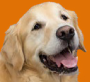
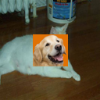
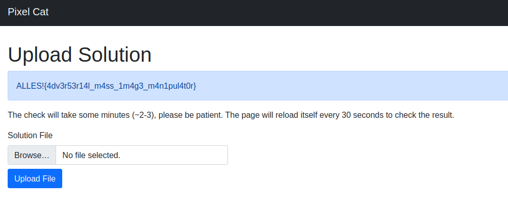

# PixelCat

> Points: 174<br>
> Solves: 42

## Challenge description
>This is the Cat Machine Learning Model testing station, above model is put under test,<br>
>by passing 500 random cat images and verifying if the model detects it correctly.<br>
>However, if the AI succeeds humans are not necessary anymore to identify cute cat pictures!!<br>
>It is your job to prevent this catastrophe and trick the model in detecting dogs instead of cats,<br>
>preventing the successful test and ultimately saving the earth.
>
>In order to achieve this, you have to upload a filter, which is applied onto these images.<br>
>But you only have a budget of 1900 Pixels. If more than 88% of the images are detected as dogs,<br>
>the ML is beaten and will release a precious secret.
>
>Attached you'll find the model under test and the same algorithm that is used to classify the images<br>
>with a filter on the server.

files: [ml-model.zip](./ml-model.zip)

## Overview
In this challenge we are given a CNN (Convolutional Neural Network) for the classification of dogs and cats.<br>
Our objective is to make the network misclassify cats as dogs with an 88% accuracy,<br>
and we can do this, by modifying at most 1900 pixels of the 128 x 128 cat images.

## Exploitation
At first glance I thought about some NN attacks I heard of, like the beautiful one pixel attack,<br>
but then I have done the math and I realized that I can overwrite almost 10% of the image.<br>
So I told to myself: "What can make a NN misclassify cats as dogs?".<br>
And the answer was obvious: "A DOG!"

I just googled "dog" and searched some beautiful dogs, I than made a script to paste the doggo<br>
in the middle of the image.

First we load the dog image and we do the math (again) to get the scaled dimension (I don't want the doggo to be stretched)
```
doggo = Image.open ("doggo.png")
height = (1900 * doggo.height / doggo.width) ** 0.5
width = 1900 / height
doggo = doggo.resize ((int (width), int (height)))
```
Then we create a new transparent image (because the server program ignores invisible pixels),<br>
and we paste the doggo right in the middle of that.
```
doggo_filter = Image.new ("RGBA", (128, 128), (0,0,0,0))
doggo_filter.paste (doggo, (128 // 2 - doggo.width // 2, 128 // 2 - doggo.height // 2))
doggo_filter.show ()
doggo_filter.save ("doggo_filter.png")
```
I had to search quite a while to find a dog image that worked, but in the end I found it.



I tried it with the test image ALLES provides us and, ignoring all the warnings Tensorflow throws at me because I don't have a GPU,
it worked!
```Checked: 1 and hacked: 1 (dog)```<br>
And as a reward, it showed me this gorgeous image.



I sent the filter to the ALLES server and after a couple minutes I got the flag.



## Flag
ALLES!{4dv3r53r14l_m4ss_1m4g3_m4n1pul4t0r}

## Fun fact
The doggo image is classified as a cat, and I somehow find this hilarious.

